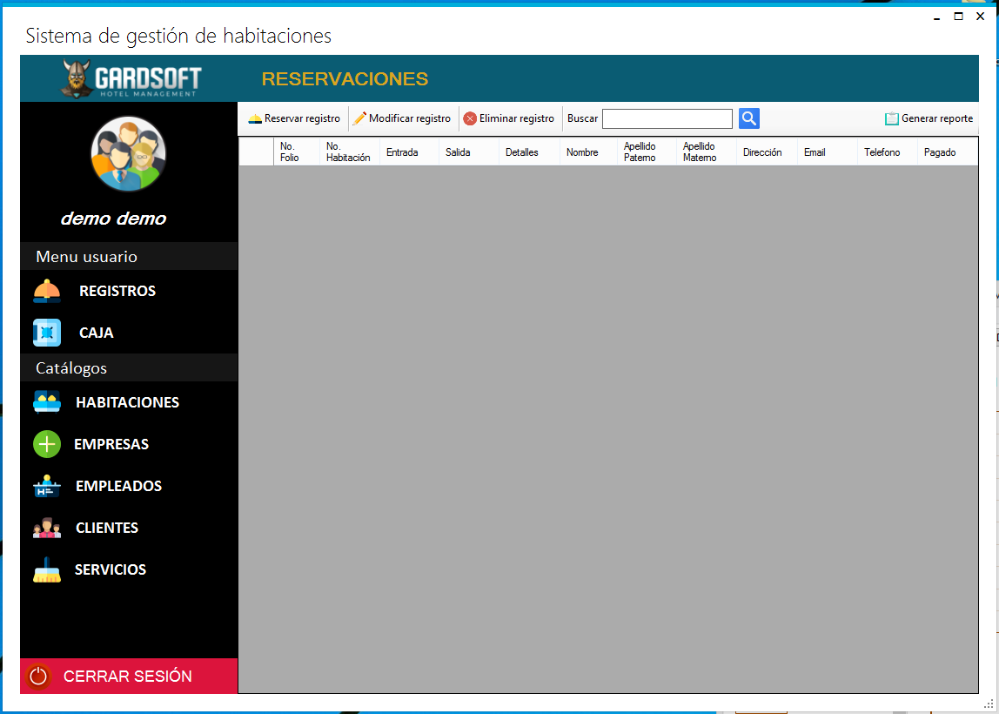

# Gardsoft - Gestor de hotel

Proyecto de gestion de habitaciones para un hotel, donde se utilizaron CRUD's para lista de clientes, servicios, habitaciones, etc.

Informacion extra:
Es necesario montar el script de la base de datos en una base de datos MySQL, y cambiar los datos del servidor en la ruta DAO/Conexion.cs de acuerdo a la instancia de su base de datos.
Tambien es necesario instalar CrystalReport para poder compilar el programa, si el programa no compila por falta de esta libreria, se puede eliminar la carpeta de Reportes, y el archivo Frm_reporte_reserva.cs ubicado en la carperta GUI.
Tambien es necesario comentar o eliminar el codigo que instancia los reportes en Frm_reservaciones.cs tal como en el ejemplo:
````
private void btn_reporte_Click(object sender, EventArgs e){
  //Frm_reporte_reserva reporte = new Frm_reporte_reserva();
  //reporte.Show();
}
````

Capturas:

Login:


Pantalla inicial:



Registro de nuevas habitaciones:


Color en el estatus de cada habitacion


Hay mas capturas en la carpeta readme-media.
